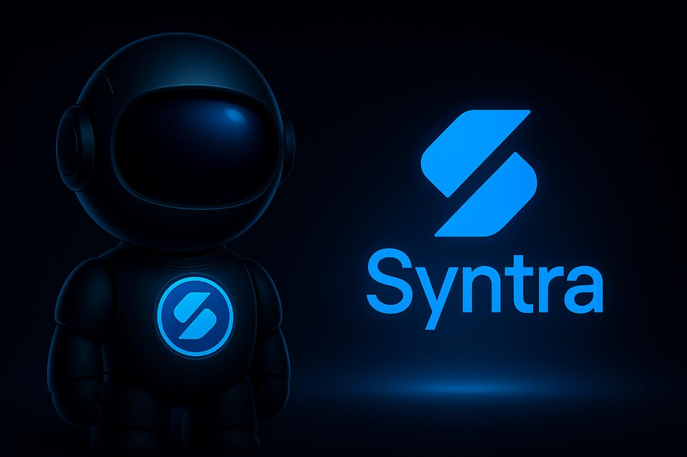

<p align="center">
  
</p>

# SyntraAI

> AI-ассистент для крипто-трейдинга с real-time данными и уникальной личностью

[](https://python.org)
[](https://fastapi.tiangolo.com)
[](https://nextjs.org)
[](https://postgresql.org)

**[Сайт](https://ai.syntratrade.xyz)** | **[Telegram Mini App](https://t.me/SyntraAI_bot?startapp)** | [English version](README.md)

## Обзор

**SyntraAI** — AI-ассистент для крипто-трейдинга с характерной саркастичной личностью. В отличие от обычных чат-ботов, Syntra предоставляет анализ рынка в реальном времени через **OpenAI Function Calling**, получая данные из множества источников, совмещает профессиональный технический анализ с циничным юмором и предлагает продвинутые функции вроде генерации фьючерсных сценариев и бумажной торговли.

### Чем Syntra отличается

- **Настоящая личность** — Не generic бот. Syntra — самоосознанный циничный AI-аналитик, который даёт серьёзные инсайты с острым юмором
- **Live данные через Tool Calling** — AI получает цены, индикаторы, новости через function calling (не статичные ответы)
- **Мульти-источники** — CoinGecko, Binance, CryptoPanic, DexScreener, CoinMetrics вместе
- **Память контекста** — Помнит историю диалога для связного многоходового анализа
- **Профессионализм + Веселье** — Технический анализ с характером (Bloomberg Terminal + саркастичный друг)

## Возможности

### AI Чат-ассистент
- **GPT-5.2 / GPT-5.1** диалоги с памятью
- **OpenAI Function Calling** для получения данных в реальном времени
- Уникальная циничная личность с профессиональными инсайтами
- Мультиязычность (English, Русский)

### Real-Time рыночные данные (Tool Calling)
- **Live цены** — Любая крипта через CoinGecko, CoinMarketCap, DexScreener
- **Технические индикаторы** — RSI, MACD, Bollinger Bands, Moving Averages
- **Свечные паттерны** — Doji, Hammer, Engulfing, Morning Star и др.
- **Fear & Greed Index** — Настроение рынка
- **Крипто-новости** — Заголовки из CryptoPanic
- **Funding Rates** — Настроения на Binance Futures
- **On-Chain метрики** — Активные адреса, потоки с бирж (CoinMetrics)
- **Рыночные циклы** — Rainbow Chart, Pi Cycle Top индикатор

### Анализ графиков (Vision)
- Анализ скриншотов через GPT-4 Vision
- Автоматическое определение монеты по графику
- Распознавание паттернов с наложением реальных данных

### Фьючерсные сценарии (Premium)
- AI-генерация торговых сценариев с точками входа/выхода
- TP1/TP2/TP3 таргеты и стоп-лосс уровни
- Risk/Reward анализ
- Оценка уверенности на основе рыночных условий

### Бумажная торговля (Forward Test)
- Тестирование сценариев без реальных денег
- Симуляция исполнения ордеров
- Трекинг портфеля с мониторингом маржи
- Статистика и win rate

### Платформа
- **Telegram Mini App** — Основной интерфейс внутри Telegram
- **Веб-приложение** — Адаптивный Next.js интерфейс
- **Лендинг** — Маркетинговый сайт ai.syntratrade.xyz

## AI Модели

| Тариф | Модели | Применение |
|-------|--------|------------|
| Free/Basic | GPT-4o-mini + DeepSeek | Чат, базовый анализ |
| Premium | GPT-5-mini + GPT-5.1 | Продвинутый анализ, фьючерсы |
| VIP | GPT-5.1 + o4-mini UltraThink | Глубокий reasoning, приоритет |

**Генерация сценариев:** GPT-5.2 (глубокий reasoning)

## Технологии

### Backend
| Технология | Назначение |
|------------|------------|
| Python 3.12 | Основной язык |
| FastAPI | REST API + WebSocket |
| SQLAlchemy 2.0 | Async ORM |
| PostgreSQL 16 | Основная БД |
| Redis | Кэширование |
| Alembic | Миграции БД |

### Frontend
| Технология | Назначение |
|------------|------------|
| Next.js 14 | React фреймворк |
| TypeScript | Типизация |
| Tailwind CSS | Стилизация |
| Lightweight Charts | Торговые графики |
| TonConnect | Web3 кошелёк |

### Интеграции
| Сервис | Назначение |
|--------|------------|
| OpenAI | GPT-5.x, Vision, Function Calling |
| DeepSeek | Экономичный AI для низших тарифов |
| Binance API | OHLC, funding rates, ликвидации |
| CoinGecko | Цены, капитализация, история |
| CoinMarketCap | Резервный источник цен |
| DexScreener | Данные DEX токенов |
| CryptoPanic | Агрегатор крипто-новостей |
| CoinMetrics | On-chain аналитика |

### Платежи
- Telegram Stars
- TON blockchain
- NOWPayments (крипто)

## Архитектура

```
┌─────────────────────────────────────────────────────────────┐
│                    PRESENTATION LAYER                        │
│  ┌─────────────┐  ┌─────────────┐  ┌─────────────────────┐  │
│  │  Telegram   │  │   Next.js   │  │   Telegram Bot      │  │
│  │  Mini App   │  │   Web App   │  │   (Notifications)   │  │
│  └──────┬──────┘  └──────┬──────┘  └──────────┬──────────┘  │
└─────────┼────────────────┼────────────────────┼─────────────┘
          │                │                    │
          ▼                ▼                    ▼
┌─────────────────────────────────────────────────────────────┐
│                      API LAYER (FastAPI)                     │
│  ┌────────────┐  ┌────────────┐  ┌────────────────────────┐ │
│  │    Auth    │  │  AI Chat   │  │   Market Data APIs     │ │
│  │  (OAuth2)  │  │ (Streaming)│  │   (Tool Calling)       │ │
│  └────────────┘  └────────────┘  └────────────────────────┘ │
└─────────────────────────────┬───────────────────────────────┘
                              │
                              ▼
┌─────────────────────────────────────────────────────────────┐
│                   BUSINESS LOGIC LAYER                       │
│  ┌────────────────┐  ┌────────────────┐  ┌───────────────┐  │
│  │ OpenAI Service │  │  Crypto Tools  │  │   Technical   │  │
│  │ (Function Call)│  │  (10+ sources) │  │   Analysis    │  │
│  └────────────────┘  └────────────────┘  └───────────────┘  │
│  ┌────────────────┐  ┌────────────────┐  ┌───────────────┐  │
│  │ Futures Engine │  │  Forward Test  │  │   Payments    │  │
│  │ (Scenarios)    │  │  (Paper Trade) │  │   Gateway     │  │
│  └────────────────┘  └────────────────┘  └───────────────┘  │
└─────────────────────────────┬───────────────────────────────┘
                              │
                              ▼
┌─────────────────────────────────────────────────────────────┐
│                    DATA ACCESS LAYER                         │
│  ┌──────────────┐  ┌──────────────┐  ┌──────────────────┐   │
│  │  PostgreSQL  │  │    Redis     │  │  External APIs   │   │
│  │  (Primary)   │  │   (Cache)    │  │  (10+ сервисов)  │   │
│  └──────────────┘  └──────────────┘  └──────────────────┘   │
└─────────────────────────────────────────────────────────────┘
```

## Структура проекта

```
SyntraAI/
├── src/
│   ├── api/                  # FastAPI routes (30+ endpoints)
│   │   ├── chat.py           # AI чат со streaming
│   │   ├── market.py         # Market data endpoints
│   │   ├── futures_*.py      # Фьючерсные сценарии
│   │   └── ...
│   ├── services/
│   │   ├── openai_service.py # AI с function calling
│   │   ├── crypto_tools.py   # 10+ определений tools
│   │   ├── coingecko_service.py
│   │   ├── binance_service.py
│   │   ├── technical_indicators.py
│   │   ├── candlestick_patterns.py
│   │   └── ...
│   ├── database/             # SQLAlchemy модели
│   └── cache/                # Redis кэширование
├── frontend/                 # Next.js приложение
├── config/
│   ├── prompts.py            # Личность Syntra
│   ├── limits.py             # Лимиты тарифов
│   └── model_router.py       # Выбор AI модели
├── alembic/                  # Миграции БД (60+)
└── tests/                    # Тесты
```

## Быстрый старт

### Требования
- Python 3.12+
- Node.js 18+
- PostgreSQL 16
- Redis

### Запуск

```bash
# Клонирование
git clone https://github.com/your-username/SyntraAI.git
cd SyntraAI

# Backend
python3 -m venv .venv
source .venv/bin/activate
pip install -r requirements.txt
cp .env.example .env  # Настройте API ключи
alembic upgrade head
python api_server.py

# Frontend
cd frontend
npm install
npm run dev
```

## Тарифы

| Тариф | Цена | Запросы | Возможности |
|-------|------|---------|-------------|
| Free | $0 | 2/день | Базовый чат, цены, новости |
| Basic | $9.99/мес | 10/день | + Паттерны, funding rates, память |
| Premium | $24.99/мес | 15/день | + Фьючерс сигналы, полный анализ |
| VIP | $49.99/мес | 30/день | + UltraThink reasoning, приоритет |

## Документация

- [Архитектура](docs/ARCHITECTURE.md)
- [API Документация](docs/API_DOCS.md)
- [Руководство разработчика](docs/DEVELOPMENT.md)
- [Деплоймент](docs/DEPLOYMENT.md)

## Лицензия

Proprietary — Все права защищены
